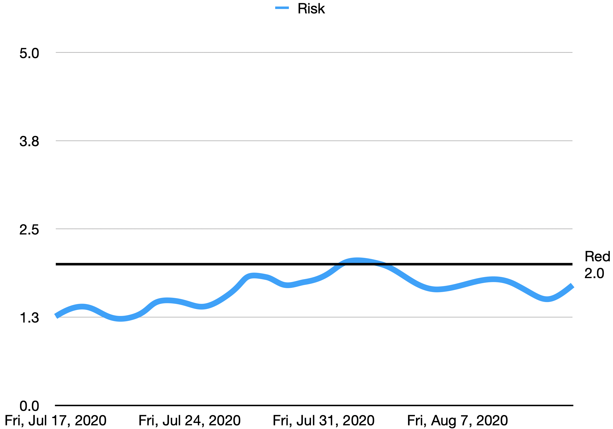
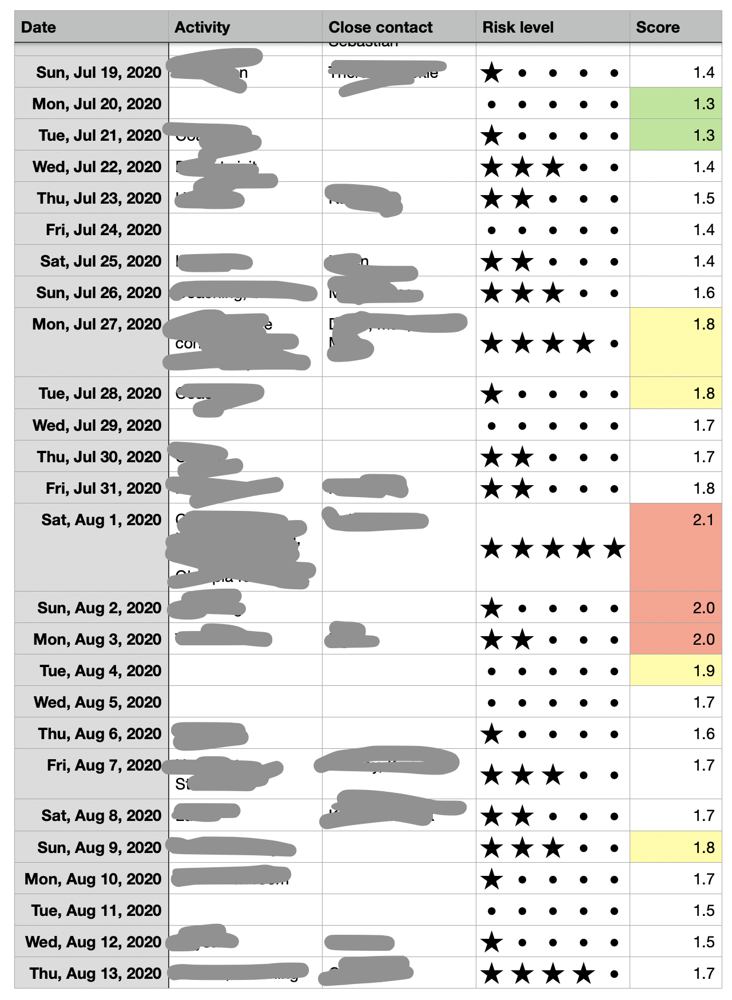

Today my COVID risk score is **1.7**.

It's better than my all-time high of **2.1** on Aug 1st, but worse than my all-time low of **1.3** in mid-July.

It is intoxicating to tame the fear and uncertainty of the pandemic with a nice number.
This number---unlike numbers for the world, country, state, county, and even city---is something I feel I have a lot of control over.
It updates daily, based on *my* activity.

Wielding this number, all I have to do is choose, then maintain, my personal risk tolerance level.
I am pretty risk-averse, and I have the luxury of working from home, so I set my red line at 2.0.

## how does this work?

The system is simple:

Judge your risk each day.
Give each day a star rating of 0 to 5 for how much risk you exposed yourself to.
Then let the spreadsheet calculate a 2-week weighted average of those stars.

## day rating

The rating is somewhat subjective depending on your lifestyle.

The best resource I've seen for judging your day is the [COVID-19 Activity Risk Index](https://www.covid19reopen.com/resources/covid-19-daily-activity-risk-index).

Here's how I rate my days, as a young single person working from home:

* I did not come in contact with anyone today and did not spend any time in public indoor spaces. **0 stars.**
* I spent 5+ minutes in a populated indoor space, such as buying coffee, and no one invaded my personal space.  **1 star.**
* I hung out with a friend.  **1 star.**
* I spent 30+ minutes in a populated indoor space, such as grocery shopping, but did not come in close/unmasked contact with anyone. **2 stars.**
* An unmasked stranger entered my personal space.  **2 stars.**
* I spent 1+ hours in a populated indoor space, such as a leisurely Costco shopping trip. **3 stars.**

These combine, so if I go Costco shopping with a friend, that's 4 stars for the day.

So, give a rating to each day.
At the end of your day, review what you did, then rate it honestly and consistently.

Here's what mine looks like:

## risk score

Now that each day has a rating, how do we combine it into a score?

> The estimated incubation period is between 2 and 14 days with a median of 5 days.

[--CDC](https://www.cdc.gov/coronavirus/2019-ncov/hcp/non-us-settings/overview/index.html)

So we care only about the last two weeks.

We could simply average the daily ratings from the last 2 weeks.
For example, if last week you gave each day 3 stars and this week you gave each day 2 stars, your risk score would be **2.5**.
This gets us most of the way there.

To do the multiplication easily, I use a spreadsheet.
I am a big fan of _Apple Numbers_.
I have it on both my phone and laptop, and my spreadsheets are shared between the two through iCloud.

We know we can get most of the way there through simply averaging your ratings from the last two weeks.
But we also know that what you did in the last 5 days matters a lot more than what you did 14 days ago.
Instead of a simple average, then, we'll apply weights that give priority to the most recent days.
Here's my table of weights:

| Days ago | Weight |
|-----|------|
| 15 | 0.14 |
| 14 | 0.28 |
| 13 | 0.42 |
| 12 | 0.56 |
| 11 | 0.70 |
| 10 | 0.83 |
| 9 | 0.97 |
| 8 | 1.11 |
| 7 | 1.25 |
| 6 | 1.39 |
| 5 | 1.39 |
| 4 | 1.39 |
| 3 | 1.39 |
| 2 | 1.39 |
| 1 | 1.39 |
| 0 | 1.39 |

I choose to go 15 days back, and "today" is the 0th day.

The weights may seem arbitrary, but they have the property that they average to exactly 1.0.
Hence, compared to a simple average, the weights do not change the magnitude of your risk score; they just rebalance the points.

Now when I say that my current risk score is **1.7**, you know it means I averaged 1.7 stars over the last 15 days,
for the weighted definition of averaged.

## planning your future

Now you can answer questions like: how does my risk score change if I hang out with X tonight?

But you can go beyond today.
In the spreadsheet you can create days into the future, estimate your risk based on your planned activity,
and forecast what your risk score will be.

This empowers you to plan ahead and prioritize how you spend your days to achieve the desired score by a certain day.

For example, suppose you are planning a trip with friends next week.
To keep yourself and your friends safe, you have a goal of **1.5** risk score by the time the trip begins, but you're at **2.5** now.
Just extend the spreadsheet to that future date and see what score you'll have.

Now you can determine exactly how much risk you'll allow yourself between now and your important trip,
to meet your goal score!

## conclusion

Thanks for reading.
I hope that this gives you the knowledge and tools to track your own risk score, if you buy into my methodology.

As a reward for sticking with me, here is [an Apple Numbers spreadsheet that you can use as a template](spreadsheet.numbers).

I look forward to your feedback.
