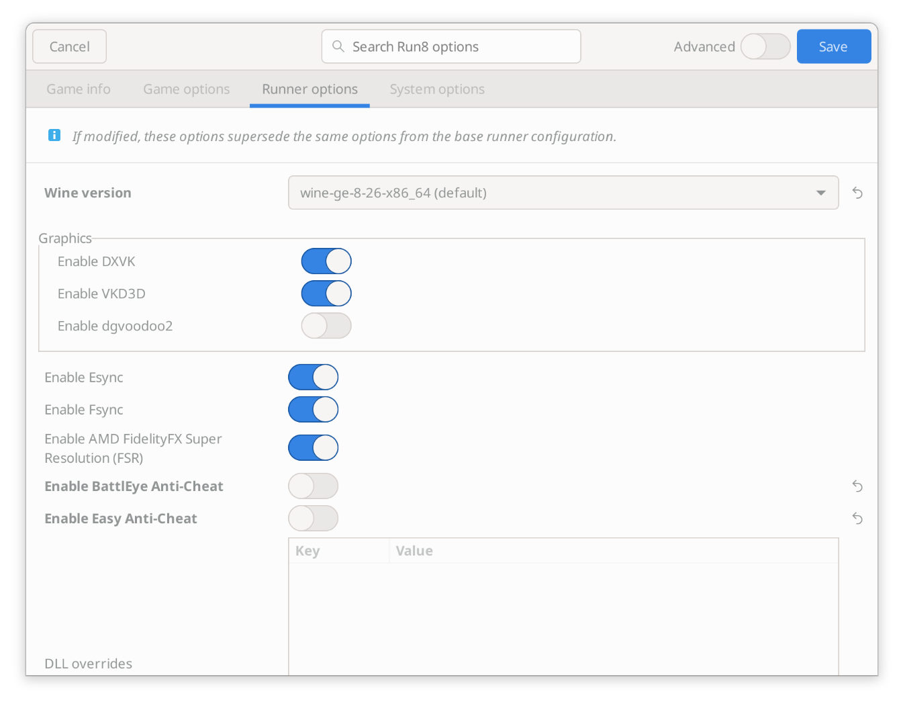

As a child, my parents would take me on trips to neighboring towns on an [elektrichka](https://en.wikipedia.org/wiki/Elektrichka), a commuter suburban electric train.
We didn't have much of a purpose in these trips; my parents were just showing me a good time. I loved everything about those train rides. Going to the train station, smelling the railroad, buying tickets, boarding, looking out at the landscape, arriving at some random town. Then, reverse.

On special occasions, we'd take a long-distance, overnight train. That was even more glorious---it was everything I liked about the commuter trains, but longer and with a sleepover!

How glorious must it be to drive one of these majestic machines? The ever-changing landscape, the full range of weather, the responsibility and honor of being responsible for a passenger train. Being a locomotive engineer was my childhood dream that I quietly nursed into adulthood.

Since then, I've learned that there are many train enthusiasts, and they even develop train simulators! Simulators range from emphasizing simplicity and low learning curve to emphasizing reality and its complexities. **[Run 8 Train Simulator](https://run8studios.com/)** has a reputation for being one of the more realistic, advanced simulators.

I've known of *Run 8* for several years and have always wanted to try it, but the hurdle for me was that it's built only for Windows, and I had only a Mac.
I first tried to run it on my Mac via *VirtualBox*, but the game wouldn't run properly. I considered getting *Parallels* as another way to run Windows within macOS, but that would cost $70--even more expensive than *Run 8* itself.

Earlier this year, I made the big decision to move from macOS to Linux (*NixOS* + *KDE Plasma*) as my personal computer. I heard rumors that someone got *Run 8* to run in *[Lutris](https://lutris.net/)*, "a video game preservation platform," so I asked the developers of *Run 8* whether I could try it before buying it, and they agreed.

In summary, *Run 8* plays beautifully on my Linux laptop, both single player and multiplayer, with some (minor?) caveats. The rest of this story walks through installing and configuring *Run 8* to play on Linux.

## setting up Run8

Start with the installer, `run8v3_install.exe`. We'll install it with [Wine](https://www.winehq.org/), the workhorse of Windows software compatibility on Linux.

We can install the game on Linux using pure Wine:

```
$ wine ~/Downloads/run8v3_install.exe
```


The graphical installer ran to completion uneventfully. This installed the game onto the "Windows filesystem" at `~/.wine`.
Already, we have enough to run the game.
But let's install the updates first.

### game updates

I downloaded the [V3 Update Installer App](https://run8studios.com/updates_dlc.shtml) and ran it with pure Wine also:

```
$ wine ~/Downloads/r8v3_run8updaterinstaller.exe
```

Go through its graphical installer; now the updater is installed onto the same Windows filesystem. Then run the installed updater with Wine:

```
$ wine ~/.wine/drive_c/Run8Studios/Run8\ Train\ Simulator\ V3/Run8_Updater.exe
002c:fixme:winediag:loader_init wine-staging 10.15 is a testing version containing experimental patches.
002c:fixme:winediag:loader_init Please mention your exact version when filing bug reports on winehq.org.
0024:fixme:winediag:loader_init wine-staging 10.15 is a testing version containing experimental patches.
0024:fixme:winediag:loader_init Please mention your exact version when filing bug reports on winehq.org.
0024:fixme:ntdll:NtQuerySystemInformation info_class SYSTEM_PERFORMANCE_INFORMATION
Run8 V3 Auto-Updater
Getting Update Manifest from Server...
Checking Manifest Against Installed Files...
1186 files to download...
...
...
...
Downloads Complete
Checking for errors...
Update Complete!  Press any key to exit...
```

Ok, the game is installed and up-to-date.

### redistributables

The game advises to install redistributables like *.Net framework*. However, in my testing, these are not necessary for the game to run on Linux. The game runs fine both with and without me installing these myself. I don't entirely understand why, but I am ok with that.

### running the game: first try with pure Wine

*Wine* has been our trusty workhorse so far; we used it for both installers and the game updater. But it falters when running the actual game.
The initial screen opens, where you select your scenario, but the game crashes once you select the scenario and try to launch the main gameplay.

```
$ wine ~/.wine/drive_c/Run8Studios/Run8\ Train\ Simulator\ V3/Run-8\ Train\ Simulator\ V3.exe 
002c:fixme:winediag:loader_init wine-staging 10.15 is a testing version containing experimental patches.
002c:fixme:winediag:loader_init Please mention your exact version when filing bug reports on winehq.org.
...
...
...
[ERROR] FATAL UNHANDLED EXCEPTION: System.TypeInitializationException: The type initializer for 'A.KKP' threw an exception. ---> System.TypeInitializationException: The type initializer for 'A.XI' threw an exception. ---> System.NullReferenceException: Object reference not set to an instance of an object
  at A.XI..cctor () [0x0001e] in <a5e116dbad404c8199d088546072f39d>:0 
   --- End of inner exception stack trace ---
  at A.KKP.K () [0x00020] in <a5e116dbad404c8199d088546072f39d>:0 
  at A.KKP..cctor () [0x00028] in <a5e116dbad404c8199d088546072f39d>:0 
   --- End of inner exception stack trace ---
  at (wrapper managed-to-native) System.Object.__icall_wrapper_mono_generic_class_init(intptr)
  at RunEight.TMUMenu.LDP () [0x000c9] in <a5e116dbad404c8199d088546072f39d>:0 
  at System.Threading.ThreadHelper.ThreadStart_Context (System.Object state) [0x00014] in <2e6290bc35d64d219e4c90c0d93f3982>:0 
  at System.Threading.ExecutionContext.RunInternal (System.Threading.ExecutionContext executionContext, System.Threading.ContextCallback callback, System.Object state, System.Boolean preserveSyncCtx) [0x00071] in <2e6290bc35d64d219e4c90c0d93f3982>:0 
  at System.Threading.ExecutionContext.Run (System.Threading.ExecutionContext executionContext, System.Threading.ContextCallback callback, System.Object state, System.Boolean preserveSyncCtx) [0x00000] in <2e6290bc35d64d219e4c90c0d93f3982>:0 
  at System.Threading.ExecutionContext.Run (System.Threading.ExecutionContext executionContext, System.Threading.ContextCallback callback, System.Object state) [0x0002b] in <2e6290bc35d64d219e4c90c0d93f3982>:0 
```
But we have more tools in our arsenal ... let's move on to Lutris.

### Lutris

I simply added the existing installation of *Run 8* to *Lutris*:


Then, when I launch it inside Lutris, it runs!


### keyboard shortcuts - resolving conflict with KDE

*Run 8* is a power user of key bindings, including a liberal use of function keys, Control, Alt, and Shift. Some of these conflict with Plasma's own key bindings, so some functionality in *Run 8* is hard to access, such as Shift-F1 (Train Maker-Upper) and Shift-F12 (camera free fly). Ideally, we want to give *Run 8* **full** control of the keyboard. Here's how.

First, bring the game from full-screen into windowed mode by pressing F4.


Second, go into KDE's "special application settings" menu from the dropdown:


Third, ignore global shortcuts:


This gives *Run 8* full control of the keyboard when the game is in focus (both full screen and windowed), so even the Super key will no longer interrupt the game.
Now, once inside the game, the only ways out are (1) F4 to enter windowed mode, then use the cursor to focus on something else, or (2) go through the game's own Exit procedure.
Meanwhile, all functionality that previously conflicted with KDE is now working, including Train Maker-Upper and flying.

## gameplay

Both single player and multiplayer works. I spent an hour or two logged into the **[Highball Run 8](https://www.highballrun8.com/)** multiplayer server.
Here, I am looking at someone else's moving train.


The game is beautiful, and you can find many more screenshots across the various Run8 communities. I feel I am not doing the game justice with my couple of screenshots, but this article isn't intended to be a review of the game. I am here to help you set up *Run 8* for yourself!

It feels very satisfying to be able to run this game on top of a fully open hardware and software stack. The laptop runs Dasharo firmware, Linux, Nixpkgs, Plasma, Wine, and Lutris -- all free and open source. The only closed-source component is the game itself.

## things that don't fully work

**Looking around with touchpad (right-click and drag) sometimes jumps around and spins.** Although this problem was consistent for me on one evening, it did not surface at all on another evening. So perhaps, if this happens, restart the game or even the desktop environment.

**Sometimes the entire computer freezes.** The audio starts looping. Nothing about it is in `journalctl` after a reboot. I can't even blame the game for this, since an unprivileged userspace application should never have this effect on a Linux system. This happened to me several times, especially (but not limited to) game start, when it is loading assets. It also once happened during a game update, which isn't even graphical. Outside of these occurrences related to *Run 8* and *Wine*, my system is overall very stable and has never frozen.

**Sometimes the start screen is all black**, and only hovering over elements causes them to draw for the first time. Again, this is very intermittent; most of the time it doesn't happen.

**The game runs only on the built-in laptop display;** I cannot place the game window on an external display. If I window it (F4), move it to the external display, and re-enter full screen (F4), it full-screens on the laptop display. I don't know if that's a limitation of the game or my desktop environment. Fortunately my laptop display is 16 inches, so it's not a major limitation.

If you find a solution to any of these, please let me know!

## what I wish to see

I am plenty happy with how *Run 8* performs on my laptop and will be buying a full license so I can play it to my heart's content. Yet, I have a few wishes.

First, I'd like to see *Run 8* advertise its compatibility with, if not support for, Linux. Perhaps if *Run 8* claimed to be compatible with Linux, I would have switched from macOS years ago! As it stands, the hard part of *gaining* compatibility is already done -- all that's left is to reap the fruits of the hard work of *Wine*, *Lutris*, and *Linux* communities. Advertising Linux compatibility would both encourage *Run 8* sales and promote free/open software as the alternative to closed ecosystems.

On the other hand, I am well aware how fragmented the Linux ecosystem is. Sometimes that's a feature, but often it's a hurdle to support and compatibility. The downside of advertising Linux compatibility is the risk of overpromising. There will certainly be Linux environments where *Run 8* doesn't run. So, my next suggestion to Run 8 Studios is to offer the game installer for unrestricted download. Let prospective customers try to install and run the game on their system before committing to buy, as I am doing. It would also allow Linux distributions to participate in providing *Run 8* to their users, which is already the case for a lot of proprietary, precompiled software.

Lastly, on the most personal and tangential note, I recognize that *Run 8* is a labor of love, probably made by a very small studio; perhaps even by one person. It fulfills a niche; it's not a blockbuster. The game is proprietary, closed source, and under full control of this small studio. If anything happens to the studio, game development would cease, and the community would be left with just its game binaries. It would be the end of the road and a huge loss to the community of train enthusiasts. **Is there a way to ensure the game's legacy and channel the community's enthusiasts into helping the game bloom?** Could we get more transparency into the roadmap? Could we gain access to the bug tracker? Could we contribute extensions to routes? Could the studio open the game's source code and encourage code contributions?

See you on the rails!


## my environment

```
Operating System: NixOS 25.11 (unstable)
KDE Plasma Version: 6.4.5
KDE Frameworks Version: 6.18.0
Qt Version: 6.9.2
Kernel Version: 6.16.7 (64-bit)
Graphics Platform: Wayland
Processors: 22 × Intel® Core™ Ultra 7 155H
Memory: 32 GiB of RAM (31.0 GiB usable)
Graphics Processor: Intel® Arc
Manufacturer: Notebook
Product Name: V54x_6x_TU
System Version: V560TU
```

* Lutris 0.5.19
* wine-10.15 (Staging)
* Run8 v3 Update 22

*Run 8* seems to run equally well when I configure the game to use *system Wine* versus the *bundled Wine*.




